# Husk — Agentic Workflow Diagram

Total system workflow showing how the AI investigator agent integrates with the deterministic security pipeline to improve analysis on borderline cases.

```mermaid
flowchart TD
    subgraph INPUT["📦 INPUT"]
        A["npm install &lt;package&gt;"]
    end

    subgraph INTERCEPT["🔒 INTERCEPT PROXY (port 4873)"]
        B["Local Express proxy intercepts\nnpm registry traffic"]
        C["Download tarball from\nregistry.npmjs.org"]
    end

    subgraph TRIAGE["🧠 TRIAGE AGENT"]
        D{"AI Triage\n(or deterministic fallback)"}
        D -->|decides which engines to activate| E["Engine Selection:\n✓ Deobfuscator?\n✓ Behavior Diff?\n✓ Sandbox?"]
    end

    subgraph ENGINES["⚙️ 6 PARALLEL DETECTION ENGINES"]
        direction LR
        F1["IOC Matcher\n─────────\nRegex rules\nC2 domains\nLifecycle scripts\nShai-Hulud patterns"]
        F2["Deobfuscator\n─────────\nBabel multi-pass:\nstring decode\neval unwrap\nconstant fold\nwrapper inline\nsuspicion scorer"]
        F3["Behavior Diff\n─────────\nAST fingerprint\nof current vs\nprevious version:\nnew capabilities\ninstall-script diff"]
        F4["Typosquat\nDetector\n─────────\nLevenshtein +\nkeyboard distance\nvs 7,000+\npopular packages"]
        F5["Package Shape\n─────────\nEmpty/stub\ndetection for\ndependency\nconfusion attacks"]
        F6["Docker Sandbox\n─────────\nIsolated container\nstrace syscalls\nseccomp profile\nnetwork monitor\nbehavior model"]
    end

    subgraph VERDICT_ENGINE["⚖️ DETERMINISTIC VERDICT"]
        G["Verdict Agent\n─────────\nAggregates all signals\nWeighted scoring\nCalibrated confidence"]
        H{"Verdict?"}
        H1["CLEAN\nhigh confidence"]
        H2["MALICIOUS\nhigh confidence"]
        H3["BORDERLINE\n─────────\n• SUSPICIOUS &lt;70% conf\n• MALICIOUS &lt;70% conf\n• CLEAN + HIGH/MEDIUM\n  signals suppressed"]
    end

    subgraph AI_AGENT["🤖 AI INVESTIGATOR AGENT (borderline only)"]
        I["STEP 1 — PLAN\n─────────\nSees: file menu (≤30 files)\n+ prior detector signals\nChooses: ≤3 files to inspect\nFrames: 1 focus question\n\n'Is this eval resolving to\nuser input or a constant?'"]
        J["READ FILES\n─────────\nBudgeted:\n≤200 lines / ≤8KB each\nAnti-hallucination:\npaths must exist in package"]
        K["STEP 2 — SYNTHESIZE\n─────────\nReads file contents\nReturns:\n• promote-to-malicious\n• promote-to-suspicious\n• downgrade-to-clean\n• no-change\n+ confidence + rationale"]
        L{"Safety Guards"}
        L1["Never downgrade\npast CRITICAL IOCs"]
        L2["Escalate threshold:\nconfidence ≥ 0.5"]
        L3["Downgrade threshold:\nconfidence ≥ 0.8"]
    end

    subgraph POLICY["🛡️ POLICY ENGINE"]
        M{"Policy\nDecision"}
        M1["✅ ALLOW\n─────────\nTarball forwarded\nnpm install proceeds\nGreen banner:\n'✓ Husk allowed pkg'"]
        M2["⚠️ WARN\n─────────\nTarball forwarded\nYellow banner:\n'⚠ Husk warned pkg'\nManual review suggested"]
        M3["🚫 BLOCK\n─────────\nHTTP 403 to npm\nRed verdict card:\nfindings + evidence\n+ recommended action\nPackage never installed"]
    end

    subgraph OUTPUT["📋 OUTPUT"]
        N1["~/.husk/intercept.log\nJSON event history"]
        N2["~/.husk/banner.log\nColored verdict banners\n(inline via shell hook)"]
        N3["Verdict Card\n─────────\nHeadline + reasons\n+ what to do\n+ husk scan command"]
    end

    A --> B
    B --> C
    C --> D
    E --> F1 & F2 & F3 & F4 & F5 & F6
    F1 & F2 & F3 & F4 & F5 & F6 --> G
    G --> H
    H -->|"CLEAN\n(confident)"| H1
    H -->|"MALICIOUS\n(confident)"| H2
    H -->|"borderline\n(~5-10% of scans)"| H3

    H1 --> M
    H2 --> M
    H3 --> I
    I --> J
    J --> K
    K --> L
    L --> L1 & L2 & L3
    L1 & L2 & L3 -->|"adjusted verdict"| M

    M -->|ALLOW| M1
    M -->|WARN| M2
    M -->|BLOCK| M3

    M1 --> N1 & N2
    M2 --> N1 & N2 & N3
    M3 --> N1 & N2 & N3

    style INPUT fill:#1e293b,stroke:#38bdf8,color:#f8fafc
    style INTERCEPT fill:#1e293b,stroke:#38bdf8,color:#f8fafc
    style TRIAGE fill:#1e293b,stroke:#a78bfa,color:#f8fafc
    style ENGINES fill:#0f172a,stroke:#94a3b8,color:#f8fafc
    style VERDICT_ENGINE fill:#1e293b,stroke:#f59e0b,color:#f8fafc
    style AI_AGENT fill:#1e293b,stroke:#a78bfa,color:#f8fafc
    style POLICY fill:#1e293b,stroke:#22c55e,color:#f8fafc
    style OUTPUT fill:#1e293b,stroke:#94a3b8,color:#f8fafc

    style H1 fill:#166534,stroke:#22c55e,color:#f8fafc
    style H2 fill:#991b1b,stroke:#ef4444,color:#f8fafc
    style H3 fill:#92400e,stroke:#f59e0b,color:#f8fafc

    style M1 fill:#166534,stroke:#22c55e,color:#f8fafc
    style M2 fill:#92400e,stroke:#f59e0b,color:#f8fafc
    style M3 fill:#991b1b,stroke:#ef4444,color:#f8fafc

    style L1 fill:#991b1b,stroke:#ef4444,color:#f8fafc
    style L2 fill:#166534,stroke:#22c55e,color:#f8fafc
    style L3 fill:#92400e,stroke:#f59e0b,color:#f8fafc
```

## How to Read This Diagram

### Phase 1 — Intercept & Triage
`npm install` hits the local proxy. Tarball is downloaded. AI triage agent (or deterministic fallback) decides which of the 6 engines to activate. IOC Matcher and Package Shape always run; Deobfuscator, Behavior Diff, and Sandbox are conditional.

### Phase 2 — Parallel Detection (deterministic)
All selected engines run concurrently via `Promise.all`. Each produces structured findings (severity, evidence, confidence). This is the fast path — the entire layer is rule-based, no LLM calls, typically completes in <2 seconds.

### Phase 3 — AI Investigator (borderline only)
The Verdict Agent scores all signals deterministically. ~90% of packages land in confident CLEAN or confident MALICIOUS and skip straight to Policy. The remaining ~5-10% are **borderline** — the deterministic layer found something but can't commit. Only these enter the two-step AI agent loop: Plan (pick files + frame question) → Read (budgeted) → Synthesize (verdict adjustment with rationale). Three hard safety guards prevent the agent from making dangerous mistakes.

### Phase 4 — Policy Gate & Output
The final verdict maps to ALLOW / WARN / BLOCK. ALLOW forwards the tarball silently. BLOCK returns HTTP 403 — npm never writes the package to disk. All decisions are logged to `intercept.log` (JSON) and `banner.log` (colored, shown inline via the shell hook).
